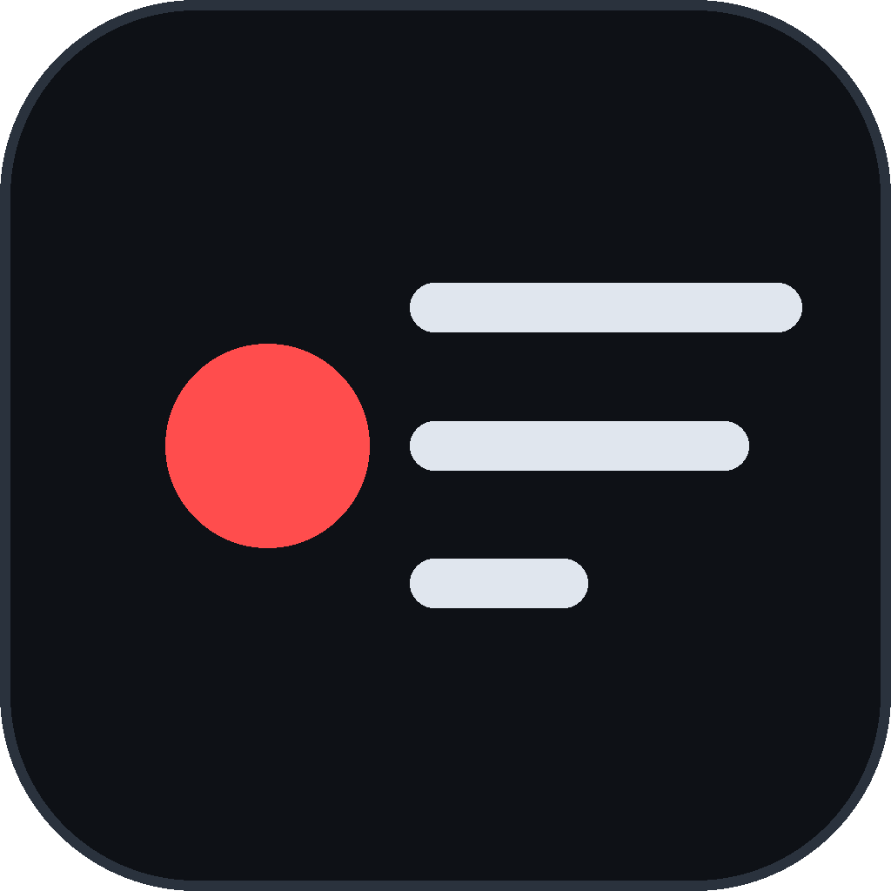
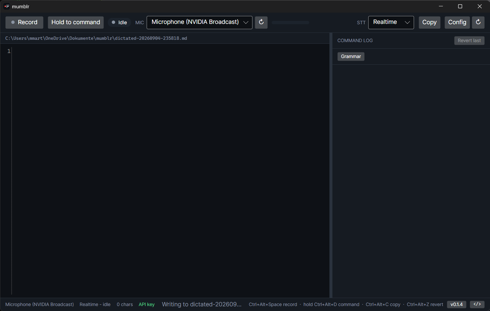

<div align="center">



# mumblr

**Talk at the repo you are standing in. Get a markdown file and your clipboard.**


[Releases](https://github.com/0xMMA/mumblr/releases) · [CI](https://github.com/0xMMA/mumblr/actions/workflows/ci.yml) · [Issues](https://github.com/0xMMA/mumblr/issues)

<!--
The repository is private, so no service can read its build status: shields.io answers
"repo or workflow not found" and GitHub's own badge endpoint answers 404. Make the repo
public and these two replace the static badges above:

[](https://github.com/0xMMA/mumblr/actions/workflows/ci.yml)
[](https://github.com/0xMMA/mumblr/releases/latest)
-->



### [Download the portable build](https://github.com/0xMMA/mumblr/releases/latest)

No installer needed - unzip `mumblr-<version>-win-Portable.zip`, put the folder on your `PATH`, done.

</div>

---

Ultra specific voice recorder for development work: get thoughts and prompts into text fast, with
minimal cleanup afterwards. Not a generic dictation tool and not system-wide typing - the output is
one markdown file in the repo folder you are standing in, plus the clipboard.

```
mumblr .
```

That creates `dictated-<timestamp>.md` in the current folder, keeps the raw `dictated-<timestamp>.wav`
next to it, and opens a window. Talk, press stop, and the whole buffer is on your clipboard while the
file stays on disk for any Claude Code session to read by path.

## The two channels

**Channel 1 - content.** Your speech becomes the text in the buffer. Two interchangeable backends,
both built, switchable in the UI:

| Mode | What it does | Keyterms |
|---|---|---|
| **Realtime** (default) | Scribe v2 Realtime over a websocket. Committed segments append as you speak, partials only show in the preview line and never enter the buffer. | 50, 20 chars |
| **Batch** | Scribe v2, one POST when you stop. Slower to first text, highest accuracy. | 1000, 50 chars |

`no_verbatim` is on, so filler words and false starts are dropped inside the model. `language_code`
is left unset for auto-detect - German with English technical terms works out of the box. Client side
there is a deterministic dictionary pass with no LLM involved (`clod code` -> `Claude Code`).

**Channel 2 - commands.** Hold the command key, say what to change, let go. The clip goes through
batch STT, and the resulting command plus the absolute file path go to your locally installed
`claude -p`, which edits the file with its own Read/Edit tools. Typical commands: *delete the last
sentence*, *replace X with Y*, *clean this up*, *turn this into a prompt*. Expect 15-30 s with Opus at
high effort. Nothing from this channel ever lands in the content file - it goes to the command log
panel, and every call is snapshotted so you can revert it.

Commands you say word for word every day belong on a button instead. `prebuiltCommands` in the
config becomes a row of buttons above the log; clicking one skips the microphone and the STT round
trip entirely and takes the identical path from there - snapshot, `claude -p`, reload, revert. The
shipped one is the sentence that gets dictated most: *Mach Grammatik, Satzbau und Satzordnung
ordentlich.*

## States

Exactly one writer at a time:

| State | Editor | Writer |
|---|---|---|
| **Idle** | free | you |
| **Recording** | locked | STT, appending at the marker set when recording started |
| **Commanding** | locked | `claude -p`, buffer reloaded from disk afterwards |

Starting a command while recording pauses channel 1 and resumes it when the command is done.

## Setup

The ElevenLabs key comes from the environment only, never from a config file or the repo:

```powershell
setx ELEVENLABS_API_KEY "your-key"    # XI_API_KEY also works
```

`claude` must be on your `PATH` for channel 2.

Everything else lives in `%APPDATA%\mumblr\config.json` (the **Config** button opens it):

| Setting | Meaning |
|---|---|
| `microphoneDeviceId` | The chosen capture endpoint. mumblr never falls back to the Windows default; if the device is gone it shows the picker. |
| `sttMode` | `Realtime` or `Batch` |
| `keyterms` | Priority ordered. The head of the list survives the realtime limit of 50. A term carrying `< > { } [ ] \` or more than five words is dropped - ElevenLabs refuses the whole request over one bad term. Past 100 terms every request is billed as at least 20 seconds, and keyterms carry a 20% surcharge. |
| `dictionary` | Literal replacements applied to committed text |
| `prebuiltCommands` | `label` and `text` per button. Sent to `claude -p` verbatim, no microphone involved. |
| `hotkeys` | `toggleRecording`, `copy`, `revertCommand`, `commandHoldKey` |
| `claude` | `model`, `effort`, `headerPrompt`, allowed/disallowed tools, timeout |
| `stt` | Model ids, `noVerbatim`, `languageCode`, base URL, VAD silence threshold, `keytermsEncoding` |
| `prebuiltCommands` | `label` and `text` per button. The label is UI, so English; the text is the prompt and stays in the language of your dictation. |

Two settings are deliberately not in the file. `ELEVENLABS_API_KEY` (or `XI_API_KEY`) carries the
transcription key, and `MUMBLR_GITHUB_TOKEN` lets the updater read the release feed of a private
repository. Both come from the environment only, never from config and never from the repo.

Default hotkeys: `Ctrl+Alt+Space` record, hold `Ctrl+Alt+D` for a command, `Ctrl+Alt+C` copy,
`Ctrl+Alt+Z` revert. They work while your IDE or terminal has focus.

## Compliance

Audio is stored by ElevenLabs on standard tiers, not just processed. Accepted risk - so do not
dictate anything that could not go into an external prompt: no credentials, no customer names, no
ticket internals. LLM processing happens only through the locally installed Claude.

Two hosts are contacted, and no others. ElevenLabs receives the audio. GitHub is asked for the
release feed at startup and when you click the version button - that request carries no
dictation, only a version check. There is no telemetry.

## Building

```
dotnet test
dotnet publish src/Mumblr.App/Mumblr.App.csproj -c Release -r win-x64 --self-contained -o publish
```

`dotnet test` never touches the network. The handful of tests that do talk to ElevenLabs are armed
separately, because they cost money on every run:

```
MUMBLR_LIVE_TESTS=1 dotnet test --filter FullyQualifiedName~LiveElevenLabs
```

They exist because the rest of the suite can only assert what mumblr sends, not what ElevenLabs
accepts - which is how the keyterm encoding shipped broken past a green build.

| Project | What it holds |
|---|---|
| `src/Mumblr.Core` | State machine, STT interface and backends, audio pipeline, config, `claude -p` invocation. Platform independent and unit tested. |
| `src/Mumblr.App` | Avalonia UI with AvaloniaEdit, WASAPI capture, Win32 hotkeys, Velopack. |
| `test/Mumblr.Core.Tests` | Core unit tests |
| `test/Mumblr.App.Tests` | Headless Avalonia tests over the whole view model, both channels |

The STT interface exists so a local backend (Whisper, Parakeet, CPU, batch) can be dropped in later
without touching the UI.

Releases are built by GitHub Actions on Windows and packaged with Velopack: tag `vX.Y.Z` and push.
